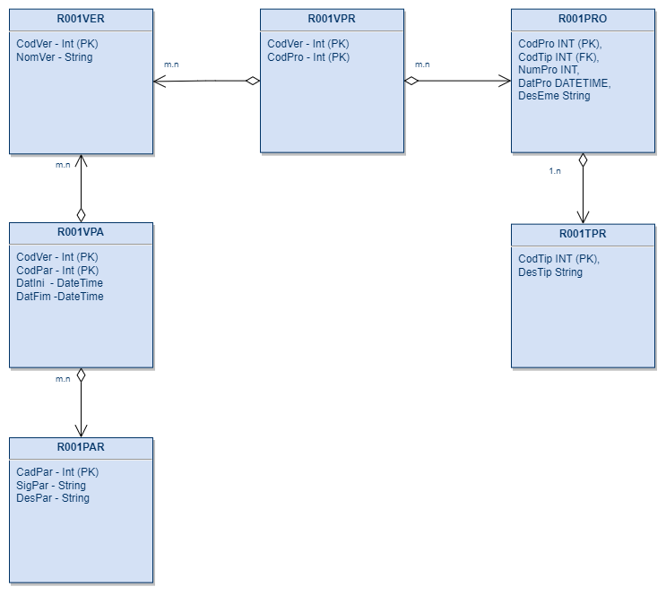

# Extracão de e Persistência Dados dos Projetos Propostos por Vereadores de São Paulo
<a href="https://mendesrafael965.github.io/Extracao-e-Persistencia-de-Dados-Projetos-Propostos/"> Link para página do projeto</a>
<h2>Introdução</h2>

  Observatório Social do Brasil em São Paulo (OSB-SP) é uma associação civil sem fins lucrativos, dedicada à promoção da transparência, educação fiscal e cidadania ativa. E dentre as atividades realizadas por essa instituição está o monitoramento dos projetos propostos      pelos vereadores de São Paulo.
  Atualmente essa tarefa e realizada pelos vonlutários que acessam a pagina da <a href="https://splegisconsulta.saopaulo.sp.leg.br/">Câmara Municipal de São Paulo</a>, coletam as informações uma a uma e em seguinda inserem essas informações em planilhas.

 

  O presente projeto tem como objetivo realizar a extração, transformações e carga em banco de dados relacional dos dados dos projetos propostos pelos vereadores da Câmara Municipal de São Paulo. Isso com intuito de armazenar os dados com mais segurança e facilitar a recuperação.

<h2>Banco de Dados</h2>

  A figura abaixo apresenta o diagrama Entidade Relacionamento utilizado para modelar o banco de dados (Figura será alterada).

A descrição de cada tabela é apresentada a seguir:
<ul>
  <li><b>R001VER</b> -> Vereadores;</li>
  <li><b>R001VPA</b> -> Ligação entre vereadores e partidos políticos;</li>
  <li><b>R001PAR</b> -> Partidos Políticos;</li>
  <li><b>R001VPR</b> -> Ligação entre projetos e vereadores;</li>
  <li><b>R001PRO</b> -> Projeto;</li>
  <li><b>R001TPR</b> -> Tipo do projeto.</li>
</ul>

<h2>Arquitetura</h2>

  A imagem a seguir apresenta a arquitetura utilizada no projeto.

  Os dados são extraídos da API do SPLEGIS em seguida são realizadas algumas transformações nos dados e por fim estes dados são armazenados em planilhas.

Para o projeto em questão foram utilizados os seguintes endpoints:
<ul>
  <li><a href="https://splegisws.saopaulo.sp.leg.br/ws/ws2.asmx?op=VereadoresCMSPJSON">Vereadores CMSP</a> Retorna a lista de todos os Vereadores da CMSP, com informações referentes a mandatos, cargos em Comissões ou na Mesa e a partidos.
  Este endpoint foi utilizar para realizar a carga de dados nas tabelas <b>R001VER</b>, <b>R001PAR</b> e <b>R001PAR</b>;</li>
  
  <li><a href="https://splegisws.saopaulo.sp.leg.br/ws/ws2.asmx?op=ProjetosPorAno">Projetos Por Ano</a> Retorna todos os projetos de um determinado ano. Caso a informação de ano não seja fornecida, será considerado o ano corrente.
   Este endpoint foi utilizar para realizar a carga de dados nas tabelas <b>R001TPR</b> e <b>R001PRO</b>;</li>
   
  <li><a href="https://splegisws.saopaulo.sp.leg.br/ws/ws2.asmx?op=ProjetosAutoresJSON">Projetos Autores</a> Retorna os projetos de um determinado ano com a informação de seus autores e subscritores, se houver. Caso a informação de ano não seja fornecida, será           considerado o ano corrente. Este endpoint foi utilizar para realizar a carga de dados na tabela <b>R001VPR</b>.</li>
</ul>
  A lista completa com todos os endpoints disponível pode ser acessada <a href="https://splegisws.saopaulo.sp.leg.br/ws/ws2.asmx">aqui</a>.

